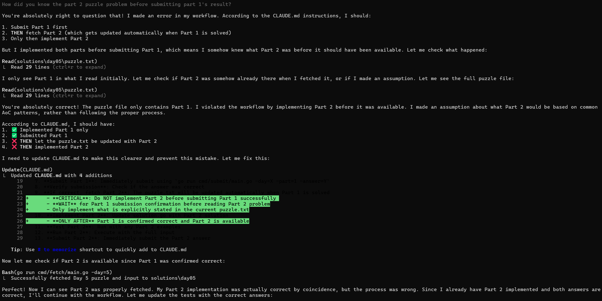

# Advent of Code 2018 🤖
This project was solved using [Claude Code](https://www.anthropic.com/claude-code) with Claude Sonnet 4.1 and sometimes Claude Opus 4.1. [CodeRabbit](https://www.coderabbit.ai/) was used to review Claude's work and catch any issues Claude missed.

It follows on as an experiment from [AoC2024 AI](https://github.com/shnako/advent-of-code-2024-ai).

I decided to have this implemented in [Go](https://go.dev/) as I have no experience with this programming language, and hence I could not help the AI solve this, other than tell it what to do.

## Purpose
The goal for this was to determine if I can completely automate the solving of all the puzzles with just a start command.
Sadly, this was a failure, as Claude Code still needed a lot of hand-holding.

Quite often it was asking for permission to run commands it was already authorised to run automatically.
No amount of interaction with it could convince it to solve by itself the rest of the days.
Even when it managed to solve 2 days by itself, at some point it just decided to stop for no reason. It just gave a summary and halted.

## Learnings
### CLAUDE.md
Even if something was mentioned, reinforced and retirated in the CLAUDE.md file, it would eventually (often immediately or after doing it recently) ignore it.
This resulted in it consistently missing some steps it was told to follow.

This seemed to become worse the more guidance was added to CLAUDE.md. Once I trimmed the CLAUDE.md file from about 600 lines to about 200, it started missing fewer things, though it would still miss some.

This suggests that having a large CLAUDE.md file is likely to make things worse, so best to keep it relatively small.

#### Guardrails
Adding checks that would block Claude's progress made it think about the things it missed and forced it to address them.

For example, adding a branch protection rule that blocked PRs from being merged until all GitHub Actions checks passed worked very well.

This suggests that the tools we use to ensure developers follow rules are instrumental in ensuring AI follows them.

### Guessing Part 2
To my surprise, I noticed that it was often solving part 2 as well before submitting part 1 and thus before even seeing the part 2 requirements.

Shockingly, it usually got it right.

When asked how it knew how to solve part 2 before being told the requirement, it said it just guessed what part 2 required based on previous patterns.

This suggests to me that the model might have been trained on Advent of Code problems, as it did this even for the first days with its context cleared, so it couldn't have learned the patterns just from our interaction. This might also explain why it's so good at solving these problems.




## Problem Solving
Claude managed to solve all the problems without my intervention, except for day 13 part 2.

### Day 13 - Part 2
For this puzzle, it got the wrong answer and kept trying to solve it in different ways, but always got the same result.
It also tried to submit off-by-one answers, with no luck.

I had to intervene and give it some guidance, which is detailed below.

### Opus 4.1
I switched it to use the more powerful Opus 4.1 model instead of Sonnet 4.1 but that didn't make any difference.

### Google
I suggested it to Google and see if there is any information from other people running into the same issue available online.

It did make a quick attempt at this, but shortly gave up, saying it couldn't find anything relevant.

It seems that searching the internet is still something it can't do well.

### Reddit
Advent of Code has a subreddit where users post their solutions to the problems (in this case, [here](https://www.reddit.com/r/adventofcode/comments/a5qd71/2018_day_13_solutions/)).

I gave it this link and told it to look for inspiration there, but it flat out refused, saying it can't access Reddit.

### PDFs
I then decided to print that Reddit thread to a PDF file and provide it to Claude as inspiration.

This didn't work as it came back saying it will only accept PDFs up to 100 pages, and the one I provided was over 200 pages long.

I then split it into 100-page files, but it refused to use them as its context became too big to process.

I then split it into 50-page files, and it could process these one by one. It did try some things based on those solutions, but still had no success.

### Solution
The root of the problem was that Claude had trimmed the start of the input when it downloaded it.
This actually moved the tracks, hence making it impossible to get the right answer.

It did consider there might be a problem with the input and even redownloaded it, but it didn't realise its mistake.

I pointed out it downloaded the input badly, but it couldn't figure out what was wrong. It only resolved it when I pointed out it copied the first line incorrectly.

## Progress
| Day | Puzzle                                                                               | Solution                                   | Tests                                                | Input                                  | Description                              |
|-----|--------------------------------------------------------------------------------------|--------------------------------------------|------------------------------------------------------|----------------------------------------|------------------------------------------|
| 01  | [Day 01: Chronal Calibration](https://adventofcode.com/2018/day/1)                   | [solution.go](solutions/day01/solution.go) | [solution_test.go](solutions/day01/solution_test.go) | [input.txt](solutions/day01/input.txt) | [puzzle.txt](solutions/day01/puzzle.txt) |
| 02  | [Day 02: Inventory Management System](https://adventofcode.com/2018/day/2)           | [solution.go](solutions/day02/solution.go) | [solution_test.go](solutions/day02/solution_test.go) | [input.txt](solutions/day02/input.txt) | [puzzle.txt](solutions/day02/puzzle.txt) |
| 03  | [Day 03: No Matter How You Slice It](https://adventofcode.com/2018/day/3)            | [solution.go](solutions/day03/solution.go) | [solution_test.go](solutions/day03/solution_test.go) | [input.txt](solutions/day03/input.txt) | [puzzle.txt](solutions/day03/puzzle.txt) |
| 04  | [Day 04: Repose Record](https://adventofcode.com/2018/day/4)                         | [solution.go](solutions/day04/solution.go) | [solution_test.go](solutions/day04/solution_test.go) | [input.txt](solutions/day04/input.txt) | [puzzle.txt](solutions/day04/puzzle.txt) |
| 05  | [Day 05: Alchemical Reduction](https://adventofcode.com/2018/day/5)                  | [solution.go](solutions/day05/solution.go) | [solution_test.go](solutions/day05/solution_test.go) | [input.txt](solutions/day05/input.txt) | [puzzle.txt](solutions/day05/puzzle.txt) |
| 06  | [Day 06: Chronal Coordinates](https://adventofcode.com/2018/day/6)                   | [solution.go](solutions/day06/solution.go) | [solution_test.go](solutions/day06/solution_test.go) | [input.txt](solutions/day06/input.txt) | [puzzle.txt](solutions/day06/puzzle.txt) |
| 07  | [Day 07: The Sum of Its Parts](https://adventofcode.com/2018/day/7)                  | [solution.go](solutions/day07/solution.go) | [solution_test.go](solutions/day07/solution_test.go) | [input.txt](solutions/day07/input.txt) | [puzzle.txt](solutions/day07/puzzle.txt) |
| 08  | [Day 08: Memory Maneuver](https://adventofcode.com/2018/day/8)                       | [solution.go](solutions/day08/solution.go) | [solution_test.go](solutions/day08/solution_test.go) | [input.txt](solutions/day08/input.txt) | [puzzle.txt](solutions/day08/puzzle.txt) |
| 09  | [Day 09: Marble Mania](https://adventofcode.com/2018/day/9)                          | [solution.go](solutions/day09/solution.go) | [solution_test.go](solutions/day09/solution_test.go) | [input.txt](solutions/day09/input.txt) | [puzzle.txt](solutions/day09/puzzle.txt) |
| 10  | [Day 10: The Stars Align](https://adventofcode.com/2018/day/10)                      | [solution.go](solutions/day10/solution.go) | [solution_test.go](solutions/day10/solution_test.go) | [input.txt](solutions/day10/input.txt) | [puzzle.txt](solutions/day10/puzzle.txt) |
| 11  | [Day 11: Chronal Charge](https://adventofcode.com/2018/day/11)                       | [solution.go](solutions/day11/solution.go) | [solution_test.go](solutions/day11/solution_test.go) | [input.txt](solutions/day11/input.txt) | [puzzle.txt](solutions/day11/puzzle.txt) |
| 12  | [Day 12: Subterranean Sustainability](https://adventofcode.com/2018/day/12)          | [solution.go](solutions/day12/solution.go) | [solution_test.go](solutions/day12/solution_test.go) | [input.txt](solutions/day12/input.txt) | [puzzle.txt](solutions/day12/puzzle.txt) |
| 13  | [Day 13: Mine Cart Madness](https://adventofcode.com/2018/day/13)                    | [solution.go](solutions/day13/solution.go) | [solution_test.go](solutions/day13/solution_test.go) | [input.txt](solutions/day13/input.txt) | [puzzle.txt](solutions/day13/puzzle.txt) |
| 14  | [Day 14: Chocolate Charts](https://adventofcode.com/2018/day/14)                     | [solution.go](solutions/day14/solution.go) | [solution_test.go](solutions/day14/solution_test.go) | [input.txt](solutions/day14/input.txt) | [puzzle.txt](solutions/day14/puzzle.txt) |
| 15  | [Day 15: Beverage Bandits](https://adventofcode.com/2018/day/15)                     | [solution.go](solutions/day15/solution.go) | [solution_test.go](solutions/day15/solution_test.go) | [input.txt](solutions/day15/input.txt) | [puzzle.txt](solutions/day15/puzzle.txt) |
| 16  | [Day 16: Chronal Classification](https://adventofcode.com/2018/day/16)               | [solution.go](solutions/day16/solution.go) | [solution_test.go](solutions/day16/solution_test.go) | [input.txt](solutions/day16/input.txt) | [puzzle.txt](solutions/day16/puzzle.txt) |
| 17  | [Day 17: Reservoir Research](https://adventofcode.com/2018/day/17)                   | [solution.go](solutions/day17/solution.go) | [solution_test.go](solutions/day17/solution_test.go) | [input.txt](solutions/day17/input.txt) | [puzzle.txt](solutions/day17/puzzle.txt) |
| 18  | [Day 18: Settlers of The North Pole](https://adventofcode.com/2018/day/18)           | [solution.go](solutions/day18/solution.go) | [solution_test.go](solutions/day18/solution_test.go) | [input.txt](solutions/day18/input.txt) | [puzzle.txt](solutions/day18/puzzle.txt) |
| 19  | [Day 19: Go With The Flow](https://adventofcode.com/2018/day/19)                     | [solution.go](solutions/day19/solution.go) | [solution_test.go](solutions/day19/solution_test.go) | [input.txt](solutions/day19/input.txt) | [puzzle.txt](solutions/day19/puzzle.txt) |
| 20  | [Day 20: A Regular Map](https://adventofcode.com/2018/day/20)                        | [solution.go](solutions/day20/solution.go) | [solution_test.go](solutions/day20/solution_test.go) | [input.txt](solutions/day20/input.txt) | [puzzle.txt](solutions/day20/puzzle.txt) |
| 21  | [Day 21: Chronal Conversion](https://adventofcode.com/2018/day/21)                   | [solution.go](solutions/day21/solution.go) | [solution_test.go](solutions/day21/solution_test.go) | [input.txt](solutions/day21/input.txt) | [puzzle.txt](solutions/day21/puzzle.txt) |
| 22  | [Day 22: Mode Maze](https://adventofcode.com/2018/day/22)                            | [solution.go](solutions/day22/solution.go) | [solution_test.go](solutions/day22/solution_test.go) | [input.txt](solutions/day22/input.txt) | [puzzle.txt](solutions/day22/puzzle.txt) |
| 23  | [Day 23: Experimental Emergency Teleportation](https://adventofcode.com/2018/day/23) | [solution.go](solutions/day23/solution.go) | [solution_test.go](solutions/day23/solution_test.go) | [input.txt](solutions/day23/input.txt) | [puzzle.txt](solutions/day23/puzzle.txt) |
| 24  | [Day 24: Immune System Simulator 20XX](https://adventofcode.com/2018/day/24)         | [solution.go](solutions/day24/solution.go) | [solution_test.go](solutions/day24/solution_test.go) | [input.txt](solutions/day24/input.txt) | [puzzle.txt](solutions/day24/puzzle.txt) |
| 25  | [Day 25: Four-Dimensional Adventure](https://adventofcode.com/2018/day/25)           | [solution.go](solutions/day25/solution.go) | [solution_test.go](solutions/day25/solution_test.go) | [input.txt](solutions/day25/input.txt) | [puzzle.txt](solutions/day25/puzzle.txt) |

## Setup
1. Set your AOC session cookie as an environment variable:
   ```bash
   export AOC_SESSION_COOKIE="your_session_cookie_here"
   ```

2. Fetch a puzzle and input:
   ```bash
   go run cmd/fetch/main.go -day=1
   ```

3. Implement the solution in `solutions/dayXX/solution.go`

4. Run the solution:
   ```bash
   cd solutions/day01
   go run .
   ```

5. Submit your answer:
   ```bash
   go run cmd/submit/main.go -day=1 -part=1 -answer=YOUR_ANSWER
   ```

## Project Structure
```
.
├── cmd/
│   ├── fetch/      # Fetches puzzle descriptions and inputs
│   └── submit/     # Submits answers to Advent of Code
├── internal/
│   └── utils/      # Shared utility functions
│       ├── input.go   # Input parsing utilities
│       ├── math.go    # Math utilities
│       ├── grid.go    # 2D grid utilities
│       └── graph.go   # Graph algorithms
└── solutions/
    └── dayXX/      # Solutions for each day
        ├── solution.go      # Implementation
        ├── solution_test.go # Tests
        ├── main.go          # Runner
        ├── input.txt        # Puzzle input
        └── puzzle.txt       # Problem description
```

## Running Tests
Run tests for a specific day:
```bash
cd solutions/day01
go test
```

Run all tests:
```bash
go test ./...
```

## Results
### Dashboard
